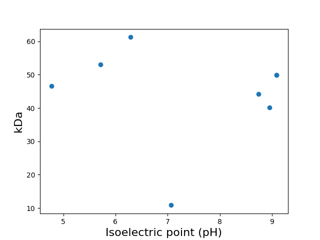
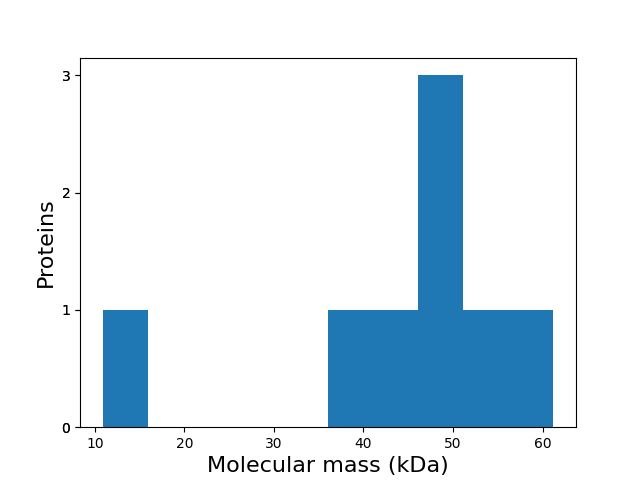

Fast-protein Software 1.0
=========================
##### Protein information software

---
### Summary
| Information                          | Value              |
| ------------------------------------ | ------------------ |
| Processed proteins                   | 8                  |
| Molecular mass (kda) mean            | 44.49 &#177; 13.99 |
| Isoeletric point mean                | 7.46 &#177; 1.62   |
| Hydrophicity mean                    | -0.36 &#177; 0.15  |
| Aromaticity mean                     | 0.07 &#177; 0.01   |
| Proteins with TM                     | 0                  |
| Proteins with SP                     | 2                  |
| Proteins with E.R Retention domains  | 2                  |
| Proteins with NGlycosylation domains | 7                  |
### Molecular mass (kDa) vs Isoelectric point (pH)

[Download in 300dpi](kda-vs-pi-300dpi.png)

### Molecular mass (kDa) histogram

[Download in 300dpi](his-kda-300dpi.png)

---
### Subcellular localization (by WolfPSort) - Organism: animal
| Subcellular localization | Quantity |
| ------------------------ | -------- |
| cyto                     | 4        |
| extr                     | 2        |
| nucl                     | 1        |
| mito                     | 1        |
---
### E.R Retention domain summary
| Domain | Quantity |
| ------ | -------- |
| SQEL   | 1        |
| HEEL   | 1        |
---
### NGlyc domain summary
| Domain | Quantity |
| ------ | -------- |
| NAT    | 2        |
| NAS    | 2        |
| NIT    | 4        |
| NYT    | 1        |
| NYS    | 1        |
| NVS    | 3        |
| NTS    | 2        |
| NET    | 2        |
| NES    | 2        |
| NST    | 2        |
Only top 10

---
Gene Ontology
-------------
#### Molecular Function
| GO         | Description                              | Total |
| ---------- | ---------------------------------------- | -----:|
| GO:0005525 | GTP binding                              |     2 |
| GO:0003746 | translation elongation factor activity   |     2 |
| GO:0003924 | GTPase activity                          |     2 |
| GO:0003735 | structural constituent of ribosome       |     1 |
| GO:0003824 | catalytic activity                       |     1 |
| GO:0008143 | poly(A) binding                          |     1 |
| GO:0004970 | ionotropic glutamate receptor activity   |     1 |
| GO:0033612 | receptor serine/threonine kinase binding |     1 |
#### Cellular Component
| GO         | Description             | Total |
| ---------- | ----------------------- | -----:|
| GO:0016020 | membrane                |     1 |
| GO:0015935 | small ribosomal subunit |     1 |
| GO:0005730 | nucleolus               |     1 |
| GO:0005840 | ribosome                |     1 |
#### Biological Process
| GO         | Description                                          | Total |
| ---------- | ---------------------------------------------------- | -----:|
| GO:0006414 | translational elongation                             |     2 |
| GO:1900364 | negative regulation of mRNA polyadenylation          |     1 |
| GO:0042254 | ribosome biogenesis                                  |     1 |
| GO:0006396 | RNA processing                                       |     1 |
| GO:0045168 | cell-cell signaling involved in cell fate commitment |     1 |
| GO:0043488 | regulation of mRNA stability                         |     1 |
| GO:0006412 | translation                                          |     1 |
---
| Id                 | Length |   kDa | Isoelectric Point | Hydropathy | Aromaticity | Subcell Localization | Transmembrane |  SignalP5   | E.R Retention Total | E.R Retention Domains | NGlyc Total | NGlyc Domains                                                                                                      |                                                                                 Header |                                        Blast description | Gene Ontology                                                                                                                                                                                              | Interpro Annotation                                                                                                                                                                                                                                                                                                                                                                                                                                                                                                                | PFAM Annotation                                                                                                | Panther Annotation                                                                |
| ------------------ | ------:| -----:| -----------------:| ----------:| -----------:|:--------------------:|:-------------:|:-----------:| -------------------:| --------------------- | -----------:| ------------------------------------------------------------------------------------------------------------------ | --------------------------------------------------------------------------------------:| --------------------------------------------------------:| ---------------------------------------------------------------------------------------------------------------------------------------------------------------------------------------------------------- | ---------------------------------------------------------------------------------------------------------------------------------------------------------------------------------------------------------------------------------------------------------------------------------------------------------------------------------------------------------------------------------------------------------------------------------------------------------------------------------------------------------------------------------- | -------------------------------------------------------------------------------------------------------------- | --------------------------------------------------------------------------------- |
| RCC1_YEAST         |    482 | 53.01 |              5.71 |      -0.44 |        0.08 |         nucl         |       0       |    OTHER    |                   0 |                       |           1 | NMS[174-177]                                                                                                       |                                                                             RCC1_YEAST | RecName: Full=Guanine nucleotide exchange factor SRM1... |                                                                                                                                                                                                            | IPR000408 - Regulator of chromosome condensation, RCC1, IPR009091 - Regulator of chromosome condensation 1/beta-lactamase-inhibitor protein II                                                                                                                                                                                                                                                                                                                                                                                     | Regulator of chromosome condensation (RCC1) repeat                                                             |                                                                                   |
| RCL1_YEAST         |    367 | 40.17 |              8.95 |      -0.03 |        0.07 |         mito         |       0       |    OTHER    |                   0 |                       |           3 | NGS[60-63];NIT[223-226];NTS[360-363]                                                                               |                                                                             RCL1_YEAST |                                         No hit - timeout | C:GO:0005730 - nucleolus, F:GO:0003824 - catalytic activity, GO:0003824, GO:0005730, GO:0006396, GO:0042254, P:GO:0006396 - RNA processing, P:GO:0042254 - ribosome biogenesis                             | IPR000228 - RNA 3'-terminal phosphate cyclase, IPR013791 - RNA 3'-terminal phosphate cyclase, insert domain, IPR013792 - RNA 3'-terminal phosphate cyclase/enolpyruvate transferase, alpha/beta, IPR016443 - RNA 3'-terminal phosphate cyclase type 2, IPR020719 - RNA 3'-terminal phosphate cyclase-like, conserved site, IPR023797 - RNA 3'-terminal phosphate cyclase domain, IPR036553 - RNA 3'-terminal phosphate cyclase, insert domain superfamily, IPR037136 - RNA 3'-terminal phosphate cyclase domain superfamily        | RNA 3'-terminal phosphate cyclase, RNA 3'-terminal phosphate cyclase (RTC), insert domain                      | RNA 3' TERMINAL PHOSPHATE CYCLASE, RNA 3'-TERMINAL PHOSPHATE CYCLASE-LIKE PROTEIN |
| RT04_YEAST         |    394 | 44.15 |              8.74 |      -0.55 |        0.07 |         cyto         |       0       |    OTHER    |                   1 | SQEL[142-146]         |           5 | NHS[151-154];NIT[181-184];NQT[222-225];NST[281-284];NET[308-311]                                                   |                                                                             RT04_YEAST |                                         No hit - timeout | C:GO:0005840 - ribosome, C:GO:0015935 - small ribosomal subunit, F:GO:0003735 - structural constituent of ribosome, GO:0003735, GO:0005840, GO:0006412, GO:0015935, P:GO:0006412 - translation             | IPR001865 - Ribosomal protein S2, IPR005706 - Ribosomal protein S2, bacteria/mitochondria/plastid, IPR018130 - Ribosomal protein S2, conserved site, IPR023591 - Ribosomal protein S2, flavodoxin-like domain superfamily                                                                                                                                                                                                                                                                                                          | Ribosomal protein S2                                                                                           | 30S RIBOSOMAL PROTEIN S2  PROKARYOTIC AND ORGANELLAR                              |
| EF1A_ASHGO         |    458 | 49.93 |              9.09 |      -0.30 |        0.07 |         cyto         |       0       |    OTHER    |                   0 |                       |           2 | NVS[311-314];NAT[338-341]                                                                                          |                                                                             EF1A_ASHGO |                                         No hit - timeout | F:GO:0003746 - translation elongation factor activity, F:GO:0003924 - GTPase activity, F:GO:0005525 - GTP binding, GO:0003746, GO:0003924, GO:0005525, GO:0006414, P:GO:0006414 - translational elongation | IPR000795 - Translational (tr)-type GTP-binding domain, IPR004160 - Translation elongation factor EFTu/EF1A, C-terminal, IPR004161 - Translation elongation factor EFTu-like, domain 2, IPR004539 - Translation elongation factor EF1A, eukaryotic/archaeal, IPR009000 - Translation protein, beta-barrel domain superfamily, IPR009001 - Translation elongation factor EF1A/initiation factor IF2gamma, C-terminal, IPR027417 - P-loop containing nucleoside triphosphate hydrolase, IPR031157 - Tr-type G domain, conserved site | Elongation factor Tu C-terminal domain, Elongation factor Tu GTP binding domain, Elongation factor Tu domain 2 | ELONGATION FACTOR 1-ALPHA 1, TRANSLATION FACTOR                                   |
| EF1A_ASHGO-2       |    458 | 49.93 |              9.09 |      -0.30 |        0.07 |         cyto         |       0       |    OTHER    |                   0 |                       |           2 | NVS[311-314];NAT[338-341]                                                                                          |                                                                           EF1A_ASHGO-2 |                                         No hit - timeout | F:GO:0003746 - translation elongation factor activity, F:GO:0003924 - GTPase activity, F:GO:0005525 - GTP binding, GO:0003746, GO:0003924, GO:0005525, GO:0006414, P:GO:0006414 - translational elongation | IPR000795 - Translational (tr)-type GTP-binding domain, IPR004160 - Translation elongation factor EFTu/EF1A, C-terminal, IPR004161 - Translation elongation factor EFTu-like, domain 2, IPR004539 - Translation elongation factor EF1A, eukaryotic/archaeal, IPR009000 - Translation protein, beta-barrel domain superfamily, IPR009001 - Translation elongation factor EF1A/initiation factor IF2gamma, C-terminal, IPR027417 - P-loop containing nucleoside triphosphate hydrolase, IPR031157 - Tr-type G domain, conserved site | Elongation factor Tu C-terminal domain, Elongation factor Tu GTP binding domain, Elongation factor Tu domain 2 | ELONGATION FACTOR 1-ALPHA 1, TRANSLATION FACTOR                                   |
| GLR1_DROME-Altered |    540 | 61.22 |              6.29 |      -0.33 |        0.10 |         extr         |       0       | SP(Sec/SPI) |                   0 |                       |           9 | NVS[66-69];NET[194-197];NVT[207-210];NIT[280-283];NES[375-378];NTS[384-387];NYT[425-428];NST[436-439];NHT[476-479] | GLR1_DROME-Altered Glutamate receptor 1 OS=Drosophila melanogaster GN=GluRIA PE=1 SV=2 |                                         No hit - timeout | C:GO:0016020 - membrane, F:GO:0004970 - ionotropic glutamate receptor activity, GO:0004970, GO:0016020                                                                                                     | IPR001828 - Receptor, ligand binding region, IPR019594 - Ionotropic glutamate receptor, L-glutamate and glycine-binding domain, IPR028082 - Periplasmic binding protein-like I                                                                                                                                                                                                                                                                                                                                                     | Ligated ion channel L-glutamate- and glycine-binding site, Receptor family ligand binding region               | GLUTAMATE RECEPTOR 3, IONOTROPIC GLUTAMATE RECEPTOR                               |
| CLV3_ARATH         |     96 | 10.87 |              7.06 |      -0.41 |        0.06 |         extr         |       0       | SP(Sec/SPI) |                   1 | HEEL[65-69]           |           0 |                                                                                                                    |                 CLV3_ARATH Protein CLAVATA 3 OS=Arabidopsis thaliana GN=CLV3 PE=1 SV=2 |                                         No hit - timeout | F:GO:0033612 - receptor serine/threonine kinase binding, GO:0033612, GO:0045168, P:GO:0045168 - cell-cell signaling involved in cell fate commitment                                                       | IPR039818 - CLAVATA3, IPR044962 - CLV3/ESR signal peptide family                                                                                                                                                                                                                                                                                                                                                                                                                                                                   |                                                                                                                | PROTEIN CLAVATA 3                                                                 |
| NAB2_SCHPO-Altered |    420 | 46.65 |              4.77 |      -0.50 |        0.07 |         cyto         |       0       |    OTHER    |                   0 |                       |           6 | NAS[82-85];NIT[125-128];NYS[161-164];NMT[273-276];NES[295-298];NAS[382-385]                                        |                                                                     NAB2_SCHPO-Altered |                                         No hit - timeout | F:GO:0008143 - poly(A) binding, GO:0008143, GO:0043488, GO:1900364, P:GO:0043488 - regulation of mRNA stability, P:GO:1900364 - negative regulation of mRNA polyadenylation                                | IPR040366 - Nuclear polyadenylated RNA-binding protein Nab2/ZC3H14, IPR043094 - Nab2/ZC3H14, N-terminal domain superfamily                                                                                                                                                                                                                                                                                                                                                                                                         |                                                                                                                | ZINC FINGER CCCH DOMAIN-CONTAINING PROTEIN 14                                     |
---
### Generated files
| File                | Link                            |
| ------------------- | ------------------------------- |
| fastprotein-csv.csv | [Download](fastprotein-csv.csv) |
| fastprotein-tsv.txt | [Download](fastprotein-tsv.txt) |
| fastprotein-sep.txt | [Download](fastprotein-sep.txt) |
| fastprotein-txt.txt | [Download](fastprotein-txt.txt) |
| wolfpsort.txt       | [Download](wolfpsort.txt)       |
| tmhmm2.txt          | [Download](tmhmm2.txt)          |
| signalp5.txt        | [Download](signalp5.txt)        |

##### Do you have a question or tips? Please contact us! E-mail: renato.simoes@ifsc.edu.br
Generated time: Sun Aug 28 04:58:23 UTC 2022